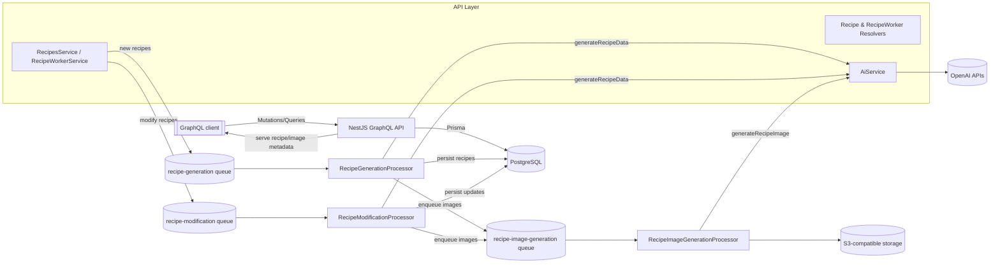
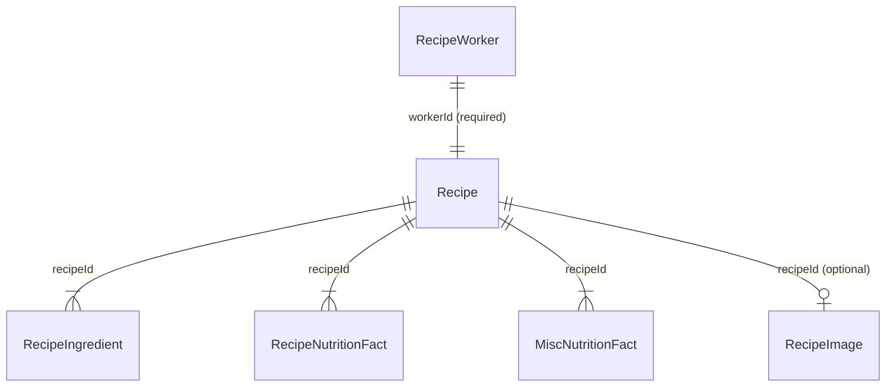

# TasteLoop Server

TasteLoop Server is a NestJS GraphQL platform that turns user prompts into fully populated recipes by combining BullMQ queues, Prisma/PostgreSQL, OpenAI text + image generation, and an S3-compatible object store. The HTTP API and background workers are deployed independently so API traffic and AI workloads can scale on their own.

## Architecture



- `src/app.module.ts` wires the GraphQL runtime, Prisma client, throttling guard, BullMQ connection, and the feature modules (`RecipesModule`, `RecipeWorkerModule`, `AiModule`).
- `AiService` (in `src/ai`) owns all OpenAI interactions: prompt moderation, structured recipe generation (`recipe-generation` format), and image uploads to object storage.
- `RecipeWorkerModule` exposes the GraphQL mutations/queries for `RecipeWorker` entities and enqueues BullMQ jobs that run inside the dedicated `queue.worker.ts` process.
- `RecipeGenerationProcessor`, `RecipeModificationProcessor`, and `RecipeImageGenerationProcessor` (in `src/recipe-worker`) consume jobs, orchestrate AI calls, persist normalized data through the Prisma service, and emit timeline entries through the recipe log service.
- `RecipesModule` exposes read-only GraphQL queries for recipes, ingredients, nutrition facts, linked workers, uploaded images, and enqueues modification requests while logging the request metadata.
- `RecipeLogsModule` centralizes audit-style events (recipe creation, image generation, modification requests/completions) and exposes the `recipeLogs` GraphQL query so clients can show a timeline for each recipe.

## Codebase tour

| Path | Description |
| --- | --- |
| `src/main.ts` | Bootstraps the HTTP GraphQL server with Express + Apollo. |
| `src/ai` | Zod schemas, OpenAI provider, and `AiService` methods that validate prompts, request recipes, and upload generated PNGs. |
| `src/recipe-worker` | GraphQL resolver/service for `RecipeWorker` plus the BullMQ processors that turn jobs into recipes, updates, and images. |
| `src/recipes` | Query resolvers, DTOs, and models that expose paginated recipe data along with related ingredients, images, and nutrition facts. |
| `src/storage/object-storage.provider.ts` | Factory that configures an S3 client targeted at DigitalOcean Spaces or the bundled MinIO stack. |
| `src/queue` | BullMQ module configuration and `queue.worker.ts`, which spins up an application context dedicated to processing background jobs. |
| `src/recipe-logs` | GraphQL models + resolver/service used to record `RecipeLog` entries and fetch the log history for a recipe. |
| `prisma/` | Prisma schema that defines recipe, worker, and nutrition models plus generated client artifacts. |

## Domain models & queue relationships



- `RecipeWorker` stores the original prompt plus the latest `RecipeStatus`. Workers begin in `CREATED`, move through `PROCESSING_RECIPE` → `RECIPE_CREATED` → `PROCESSING_IMAGE` → `READY`, and can fall back to `ERROR` or `INVALID`.
- `Recipe` rows own sub-collections (ingredients, nutrition facts, misc facts) and hold a required `workerId` so the API can traverse back to the job that created the record.
- `RecipeImage` persists object-storage metadata so clients can render generated images without touching S3 credentials.

### Queue lifecycle

1. `RecipeWorkerResolver.create` validates the prompt and creates a `RecipeWorker`.
2. `RecipeWorkerService` enqueues a `recipe-generation` job handled by `RecipeGenerationProcessor`.
3. `RecipeGenerationProcessor` calls `AiService.generateRecipeData`, upserts a full recipe tree, updates the worker’s status, and emits a follow-up `recipe-image-generation` job.
4. `RecipeImageGenerationProcessor` loads the recipe + relations, builds the image prompt, calls `AiService.generateRecipeImage`, stores metadata in Prisma, and marks the worker `READY`.
5. `RecipesResolver.modifyRecipe` logs the sanitized request, marks the worker `PENDING_MODIFICATIONS`, and enqueues a `recipe-modification` job.
6. `RecipeModificationProcessor` reuses `AiService.generateRecipeData` to overwrite the recipe tree, sets the worker back to `RECIPE_CREATED`, emits a new `recipe-image-generation` job, and records a `RECIPE_MODIFIED` log.
7. GraphQL queries in `RecipesResolver` expose the hydrated recipe, worker, and image metadata to clients.

### Queued recipe modifications

- Use the `modifyRecipe` GraphQL mutation to request ad-hoc changes; the API sanitizes the prompt, flips the worker to `PENDING_MODIFICATIONS`, records a `MODIFICATION_REQUESTED` log, and enqueues a `recipe-modification` job.
- The mutation immediately returns the current `RecipeModel`, allowing clients to refresh UI state (e.g., worker status) while the background job runs.
- `RecipeModificationProcessor` rebuilds the recipe via `AiService.generateRecipeData`, overwrites the recipe tree, re-enqueues image generation, and emits a `RECIPE_MODIFIED` log once the updates succeed.
- The `recipeLogs(recipeId: String!)` query still surfaces the chronological feed of creation, modification requests/completions, and image generations so UIs can surface progress updates.

Example GraphQL operation:

```graphql
mutation ModifyRecipe($recipeId: String!, $prompt: String!) {
  modifyRecipe(recipeId: $recipeId, prompt: $prompt) {
    id
    name
    worker {
      id
      status
    }
  }
}
```

## Running the application

### Prerequisites

- Node.js 20+
- npm 10+
- PostgreSQL database
- Redis- or Valkey-compatible queue backend
- OpenAI API key with access to `gpt-5` and `gpt-image-1`

Copy `.env.example` to `.env` and provide at least:

- `DATABASE_URL`
- `OPENAI_API_KEY`
- `REDIS_HOST`, `REDIS_PORT`, `REDIS_USERNAME`, `REDIS_PASSWORD` (username/password optional for local queues)

### Install dependencies & generate Prisma client

```bash
npm ci
npm run prisma:generate
```

### Start the HTTP API

```bash
npm run start:dev
```

- Runs the NestJS GraphQL server with file watching enabled.
- Auto-generates the schema at `schema.gql`.

### Start the queue worker

```bash
npm run start:queue:dev
```

- Spins up `src/queue/queue.worker.ts`.
- Processes `recipe-generation`, `recipe-modification`, and `recipe-image-generation` queues in the same Node process.
- The worker intentionally runs separately from the HTTP server so you can scale replicas independently.

### Docker workflow

Use the bundled Compose stack to provision PostgreSQL, Valkey, MinIO object storage, the API server, and the worker:

```bash
docker compose up --build
```

- `app` exposes the GraphQL API at `http://localhost:3000`.
- `queue` runs the BullMQ worker (watch mode).
- `valkey` provides Redis-compatible storage for BullMQ.
- `object-storage` runs MinIO plus a bootstrap container that creates the configured bucket.

### Test, lint, and type-check

```bash
npm run lint && npm run format && npm run prisma:format
npm run test
npm run test:cov
npm run test:e2e
npm run tsc
```

### Production build

```bash
npm run build          # emits dist/
npm run start:prod     # HTTP server (dist/main.js)
npm run start:queue    # worker (dist/queue/queue.worker.js)
```

## Configuration

### Object storage

The AI image pipeline uploads PNGs to an S3-compatible bucket. Configure the following environment variables (see `.env.example`):

- `SPACES_ENDPOINT` – e.g. `https://nyc3.digitaloceanspaces.com` or `http://localhost:9000` for MinIO.
- `SPACES_REGION`
- `SPACES_BUCKET`
- `SPACES_ACCESS_KEY_ID`, `SPACES_SECRET_ACCESS_KEY`
- `SPACES_FORCE_PATH_STYLE` – set `true` for MinIO, `false` for DigitalOcean Spaces.
- `SPACES_OBJECT_ACL` – optional; defaults to `public-read`.

Running `docker compose up` provides a MinIO UI at [http://localhost:9001](http://localhost:9001) with the credentials defined in `.env`. The app container points to `http://object-storage:9000` and forces path-style URLs automatically.

### Database helpers

```bash
npm run prisma:migrate         # create a new migration interactively
npm run prisma:migrate:prod    # apply committed migrations without prompts
npm run prisma:format          # format schema.prisma
npm run prisma:studio          # open Prisma Studio
```

## License

UNLICENSED
